# Hi, I'm Megh Patel 👋

<table align="center" border="0" cellpadding="0" cellspacing="0" width="100%">
  <tr>
    <td valign="top" align="center" width="50%">
      
    </td>
    <td valign="top" align="center" width="50%">
      
    </td>
  </tr>
</table>

A coder building web and Python projects. I enjoy creating interactive interfaces, small games, and learning new technologies through hands-on projects.

---

## 🌐 Portfolio

A personal website showcasing my projects, skills, and experience.

  <a href="https://megh-patel-portfolio.vercel.app/" target="_blank">
    
     
    👉 Click here to visit my live portfolio
  </a>

---

## 💻 Featured Projects

| Project | Description | Tech Stack |
| :--- | :--- | :--- |
| [**Gemini Clone**](https://github.com/MeghPatel-007/gemini-clone) | Responsive frontend clone of Google's Gemini AI with API integration. | React, JavaScript, CSS |
| [**LaceUp**](https://github.com/MeghPatel-007/laceup) | Multi-page modern personal e-commerce website design. | HTML, CSS, JavaScript |
| [**Netflix Landing Page**](https://github.com/MeghPatel-007/netflix) | Fully responsive clone of the Netflix home landing page. | HTML, CSS, JavaScript |
| [**Rent Calculator**](https://github.com/MeghPatel-007/rent-calculator) | Terminal-based utility to calculate and split bills and rent per person. | Python |

---

## 🌐 Socials

  
  &nbsp;&nbsp;
  
  &nbsp;&nbsp;
  

---

## 💻 Tech Stack

### 🔤 Languages
    

### 🎨 Frontend
  

### 🗄️ Databases
 

### 🛠️ Tools & Design
 

---

## 📈 GitHub Activity

  

  
    
  

---

## 🧩 Holopin Badges

  

